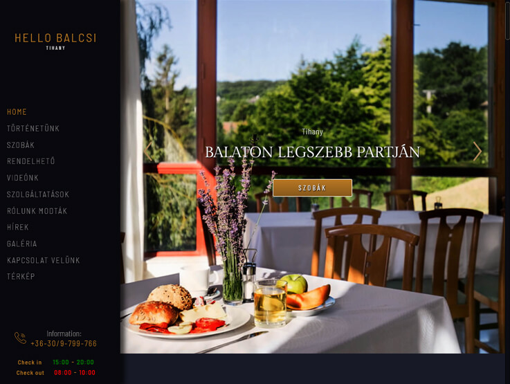

# [Hello Balcsi Tihany](https://lebryere.github.io/Hello-balcsi/)

## Browser Support

 |  |  |  |  | 
--- | --- | --- | --- | --- | --- |
94+ ✔ | 92+ ✔ | 89+ ✔ | 82+ ✔ | 87+ ✔ | 55+ ✔ |

## Preview

[](https://lebryere.github.io/Hello-balcsi/)

**[View Live Preview](https://lebryere.github.io/Hello-balcsi/)**

## Status

[](https://raw.githubusercontent.com/LeBryere/Hello-balcsi/LICENCE)

## Usage

### Basic Usage


The inspiration for the site comes from the Hello Balcsi.

### Variables
```css
@import "variables";
@import "utilities";
@import "utilitiesColors";
@import "preloader";
@import "toTop";
@import "animations";

$bgDesignHSL: hsl(233, 25%, 5%);
$design: #b97824;
:root {
   @for $i from 80 through 20 {
      @if $i % 20==0 {
         $percentage: $i * 1%;
```

## Copyright and License

Copyright 2024 Lebryere. Code released under the [](https://raw.githubusercontent.com/LeBryere/Hello-balcsi/LICENCE)
